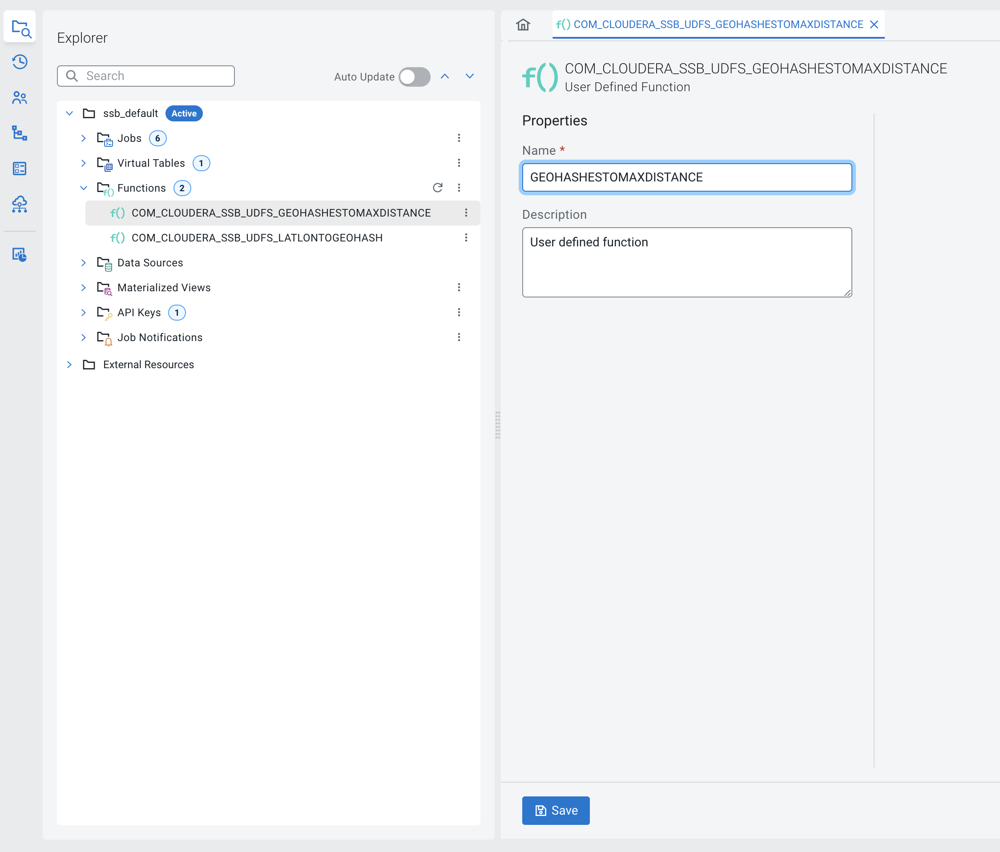
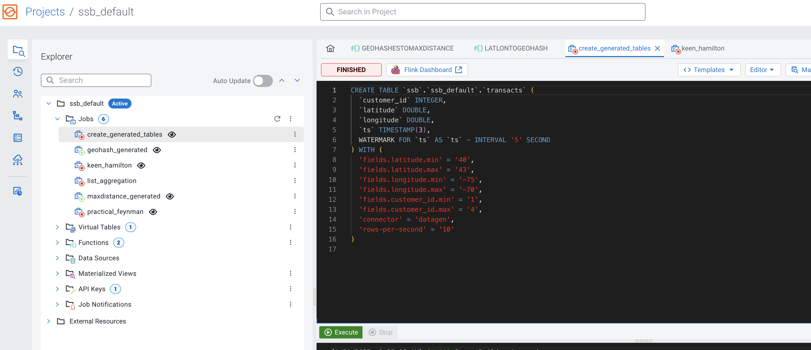

# User Defined Functions for Flink and SQL Stream Builder
This repo contains user defined functions written in java that can be 
used in Flink programs or loaded into [Cloudera SQL Stream Builder](https://docs.cloudera.com/csa/latest/ssb-overview/topics/csa-ssb-key-features.html).
## Motivation
The provided UDFs help users work with geographic coordinates more efficiently to help 
accelerate use cases such as fraud detection and cybersecurity.  
## User Defined Functions
### STRING LatLonToGeohash(DOUBLE latitude, DOUBLE longitude)
Convert a latitude and longitude to a [geohash](https://en.wikipedia.org/wiki/Geohash) with precision 12.
#### Example Query
```sql
select customer_id, latitude, longitude, LATLONTOGEOHASH(latitude, longitude) as geohash from transacts
```
#### Example Results
| customer_id | latitude | longitude | geohash |
|------------|---------|----------|---------|
| 2         | 41.93268000488155       |-73.98376486706323|dr7qs3wet64e|

### DOUBLE GeohashesToMaxDistance(STRING geohashesCSV)
Calculate the maximum distance in kilometers between a comma separated list of locations represented by geohashes.
#### Example Query
```sql
SELECT customer_id, locations, window_start, window_end, cnt, window_end, GEOHASHESTOMAXDISTANCE(locations) as distance_between
FROM
(
    select 
        customer_id, 
        LISTAGG( distinct LATLONTOGEOHASH(latitude, longitude)) as locations, 
        count(*) as cnt,
        window_start, 
        window_end 
        FROM TABLE(TUMBLE(TABLE transacts, DESCRIPTOR(ts), INTERVAL '2' MINUTES))
    GROUP BY customer_id, window_start, window_end
    having count(*) > 1
) TBL
where
GEOHASHESTOMAXDISTANCE(locations)  > 10
```
#### Example Results
| customer_id | locations         | window_start       | window_end | cnt | distance_between|
|------------|-------------------|--------------------|--------------|----|----- |
| 2         | drmkuv7yb9xr,drmkucyxcgrx | 2025-01-30T19:56:00 | 2025-01-30T19:56:00 | 2  | 2.1415052192710236|


### Example table created by datagen
```sql
CREATE TABLE `ssb`.`ssb_default`.`transacts` (
  `customer_id` INTEGER,
  `latitude` DOUBLE,
  `longitude` DOUBLE,
  `ts` TIMESTAMP(3),
  WATERMARK FOR `ts` AS `ts` - INTERVAL '5' SECOND
) WITH (
  'fields.latitude.min' = '40',
  'fields.latitude.max' = '43',
  'fields.longitude.min' = '-75',
  'fields.longitude.max' = '-70',
  'fields.customer_id.min' = '1',
  'fields.customer_id.max' = '4',
  'connector' = 'datagen',
  'rows-per-second' = '10'
)
```
## How to Use UDFs in Cloudera SQL Stream Builder
SQL Stream Builder allows users to leverage Flink's SQL on streams capabilities without writing code. 
After executing the following steps you will be able to use the UDFs in this github to 
calculate geohashes and compute distances.  
1. Build the ssb-flinksql-udfs.jar file containing the User Define Function code.
```shell
git clone https://github.com/carolynduby/ssb-flinksql-udfs.git
cd ssb-flinksql-udfs
mvn clean install
```
2. Open the SQL Stream Builder console and open the project you are using.

3. Right click the ... menu to the right of Functions and select Upload JAR.


4. Click Upload JAR from the User Defined Function dialog. 

5. Select the ssb-flinksql-udfs jar file from the target directory.

6. Click Create.  

7. The new UDFs will appear in the Functions folder.

8. Double click on each UDF.  SSB creates a fully qualified name for each UDF.  You can change the name so the UDF is easier to use in SQL. To use the queries below use the names specified below.
Remove the text COM_CLOUDERA_SSB_UDFS_ from the beginning of the name so the function is called GEOHASHESTOMAXDISTANCE.
 
9. Remove the prefix COM_CLOUDERA_SSB_UDFS_ from the second UDF so the UDF name is LATLONTOGEOHASH.   

9. We are now ready to try out the UDFs in SQL.  Create a new job and create a generated table with latitudes and longitudes.  Paste the SQL into the job and click Execute.  Flink generates records for the table.
```sql
CREATE TABLE `ssb`.`ssb_default`.`transacts` (
`customer_id` INTEGER,
`latitude` DOUBLE,
`longitude` DOUBLE,
`ts` TIMESTAMP(3),
WATERMARK FOR `ts` AS `ts` - INTERVAL '5' SECOND
) WITH (
'fields.latitude.min' = '40',
'fields.latitude.max' = '43',
'fields.longitude.min' = '-75',
'fields.longitude.max' = '-70',
'fields.customer_id.min' = '1',
'fields.customer_id.max' = '4',
'connector' = 'datagen',
'rows-per-second' = '10'
)
```

10. Create a new job with the query below and click Execute.  View the results of the query in the sample window below.
```sql
select customer_id, latitude, longitude, LATLONTOGEOHASH(latitude, longitude) as geohash from transacts
```

11. Create another new job with the query below and click Execute.   View the results in the sample window below.
```sql
SELECT customer_id, locations, window_start, window_end, cnt, GEOHASHESTOMAXDISTANCE(locations) as distance_between
FROM
(
    select 
        customer_id, 
        LISTAGG( distinct LATLONTOGEOHASH(latitude, longitude)) as locations, 
        count(*) as cnt,
        window_start, 
        window_end 
        FROM TABLE(TUMBLE(TABLE transacts, DESCRIPTOR(ts), INTERVAL '2' MINUTES))
    GROUP BY customer_id, window_start, window_end
    having count(*) > 1
) TBL
where
GEOHASHESTOMAXDISTANCE(locations)  > 10
```

12.  Congratulations!  You built and loaded UDFs and used them in a query.  Now try some other examples.

